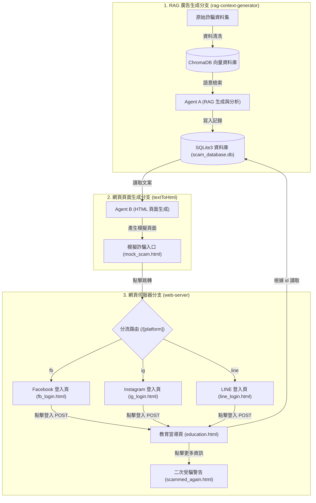

# Amazing-Scam-Pro 系統架構與工作流程說明書

本文件詳細說明專案的整體系統架構、Agent 工作流程以及 Web 伺服器運行邏輯。本專案透過三個不同的功能分支（Branches）進行協同開發與整合。

---

## 1. 系統架構與使用者流向圖 (System Flowchart)

以下為本專案的完整運作流程圖，涵蓋了「Agent 開發生成階段」與「Web 伺服器運行與使用者互動階段」：

---

## 2. 三大分支功能與工作分配 (Branch Specifications)

專案主要分為三個部分進行開發，並透過 Git 分支進行協作：

### 💻 分支一：`rag-context-generator` (RAG 廣告生成與分析)
* **核心職責**：建立防詐騙模擬所需的原始廣告內文，並使用大語言模型分析對應的詐騙手法。
* **技術細節**：
  1. 將收集到的「詐騙資料集」進行清洗，並匯入至本地向量資料庫 **ChromaDB** 中。
  2. **Agent A** 接收生成主題（Query），透過 RAG（檢索增強生成）檢索 ChromaDB 中的相似案例作為參考範本。
  3. 呼叫本地的 Ollama 模型（例如 `qwen2.5:7b`）生成高擬真的「詐騙廣告文案」，並分析出該廣告所屬的「詐騙手法類型（Scam Type）」。
  4. 隨機生成一個 **15 位數的唯一識別碼 (id)**。
  5. 將 `id`、`context` (廣告文案) 和 `scam_type` (詐騙手法) 寫入 SQLite3 資料庫中（資料表為 `scams`）。

### 🎨 分支二：`textToHtml` (網頁結構與跳轉鏈接)
* **核心職責**：將 Agent A 生成的內文轉換成高擬真的釣魚網站頁面結構，並建立與後端伺服器串接的外部跳轉連結。
* **技術細節**：
  1. **Agent B (Prompt Engineer)** 讀取 Agent A 產出的詐騙廣告文案。
  2. 規劃並產出前置測試頁面 `mock_scam.html`（作為模擬誘發點）。
  3. 在頁面中嵌入跳轉至不同社群平台的假登入按鈕，跳轉連結**必須強制攜帶廣告 ID** 作為 Query 參數。
  4. 請求網址格式規範：
     * Facebook：`http://127.0.0.1:5000/fb?id={ad_id}`
     * LINE：`http://127.0.0.1:5000/line?id={ad_id}`
     * Instagram：`http://127.0.0.1:5000/ig?id={ad_id}`

### 🌐 分支三：`web-server` (網頁伺服器與防詐教育宣導)
* **核心職責**：處理網頁路由分流、渲染假登入頁面，並在使用者被騙後進行反詐騙教育宣導。
* **技術細節**：
  1. 使用 **Flask** 架設後端伺服器（`app.py`）。
  2. **分流處理**：當接收到 `/fb`、`/line` 或 `/ig` 請求時，檢查是否攜帶 `id` 參數。若無則跳轉至 `invalid_link.html`；若有則渲染對應平台的假登入頁面（套用各平台的專屬視覺 CSS）。
  3. **登入攔截**：使用者在假登入頁點擊「登入」按鈕時，表單會以 POST 方式提交 `id` 至 `/education` 路由。
  4. **教育網站展示**：`/education` 路由會連線至 SQLite3 資料庫，使用 `id` 撈取對應的 `context`（您剛才看見的廣告）與 `scam_type`（這其實是XX詐騙手法！），並將其渲染在 `education.html` 頁面上，達到反詐教育目的。
  5. **二次受騙警告**：在教育頁面中，若使用者點擊「更多資訊」（或誤以為是重新演練），會被導向至 `/scammed_again` 頁面（展示 `boss_bg.mp4` 背景影片），嚴厲警告「你又被騙了！」，並引導至內政部警政署 165 全民防騙網。

---

## 3. 資料庫設計說明 (Database Schema)

本專案使用 SQLite3 作為儲存媒介，資料庫名稱配置於環境變數 `SQLITE_DB_FILE`（預設為 `scam_database.db`）。

### 資料表：`scams`
| 欄位名稱 (Column) | 資料型態 (Type) | 屬性 (Attributes) | 說明 (Description) |
| :--- | :--- | :--- | :--- |
| **id** | TEXT | PRIMARY KEY | 15 位數隨機唯一識別碼 (廣告 ID) |
| **context** | TEXT | - | Agent A 生成的高擬真詐騙廣告文案內容 |
| **scam_type** | TEXT | - | Agent A 分析出的詐騙手法分類名稱 |
